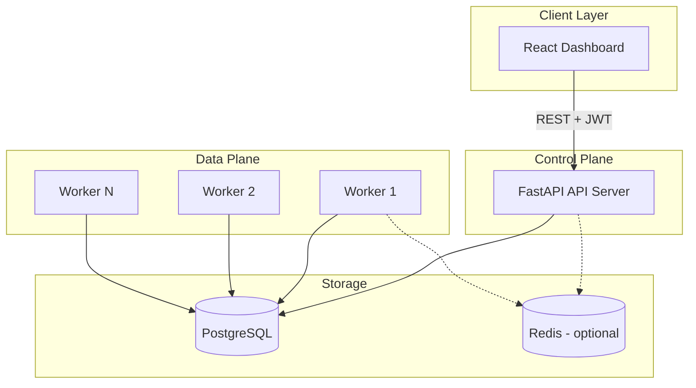
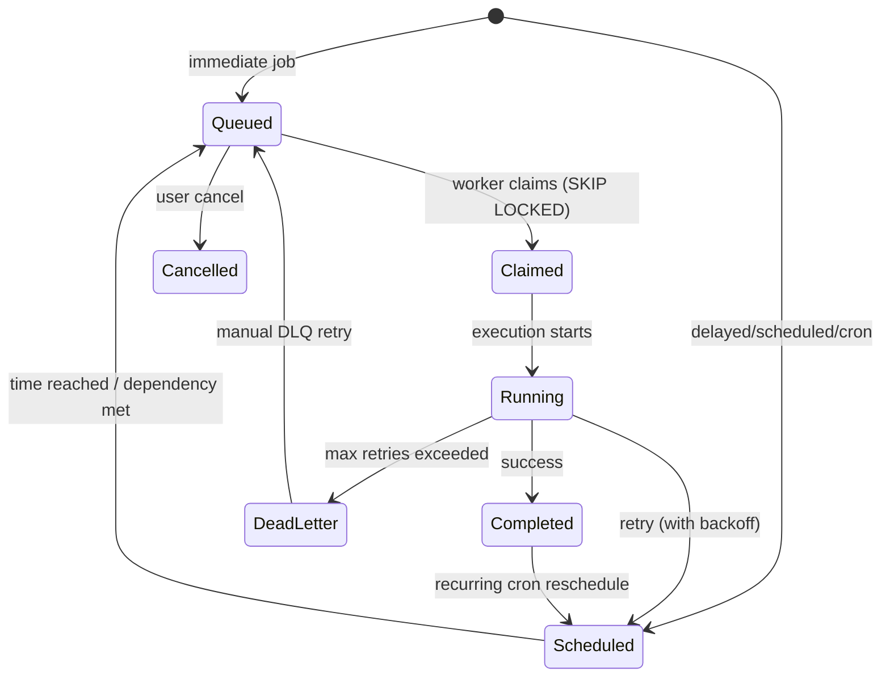

# Architecture

## System Overview

The platform follows a **control plane / data plane** separation:

- **API Server (Control Plane)** — Handles authentication, CRUD for organizations/projects/queues/jobs, metrics aggregation, and DLQ management. Stateless; horizontally scalable.
- **Worker Service (Data Plane)** — Polls queues, atomically claims jobs, executes them concurrently, sends heartbeats, and handles retries/DLQ routing. Horizontally scalable; each worker registers itself in the database.
- **PostgreSQL (Source of Truth)** — Stores all entities, job state, execution history, and worker registry. Uses row-level locking for atomic job claiming.
- **React Dashboard** — Polls the API every 3–5 seconds for live updates.

## Job Lifecycle State Machine

## Atomic Job Claiming

Workers use a single SQL statement with `FOR UPDATE SKIP LOCKED` to prevent duplicate execution:

1. Find queues that are not paused and under their concurrency limit
2. Select the highest-priority oldest eligible job
3. Atomically update status to `claimed` with worker ID

This pattern is the industry standard (used by Sidekiq, Celery with DB broker, Faktory, etc.).

## Component Responsibilities

| Component | Responsibility |
|-----------|---------------|
| API | Auth, validation, job enqueue, queue config, metrics, DLQ retry |
| Worker | Poll, claim, execute, heartbeat, retry/DLQ routing, graceful shutdown |
| PostgreSQL | Persistent state, atomic claims, execution audit trail |
| Dashboard | Visualization, job management, live status via polling |

## Deployment Topology

For production, recommended deployment:

- API: 2+ replicas behind a load balancer
- Workers: N replicas (scale based on queue depth)
- PostgreSQL: Primary + read replica for metrics queries
- Redis: Optional for distributed rate limiting and pub/sub events

## Scalability Considerations

- **Horizontal worker scaling** — Add workers without coordination; `SKIP LOCKED` prevents contention
- **Queue concurrency limits** — Enforced at claim time via subquery counting active jobs per queue
- **Partial indexes** — On `scheduled_at` for efficient promotion of due jobs
- **Idempotency keys** — Unique partial index prevents duplicate job creation
